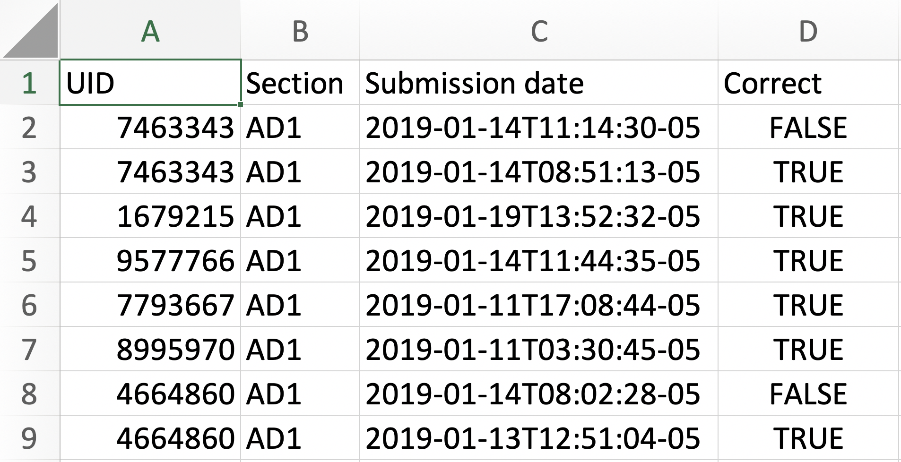

# README

## Basic Usage
For TAM 251 instructors at UIUC looking to grade pre-discussion assignments:
- Download `dprep_grade.py`
- Follow  ["How to use the grader"](#how-to-use-the-grader) instructions below

## Contents of this Repository

### What is `dprep_grade.py`?
`dprep_grade.py` is a script for evaluating pre-discussion assignment submissions for [TAM 251](https://courses.physics.illinois.edu/tam251) at the University of Illinois Urbana-Champaign. It works by looking at provided submission files (as CSV files) downloaded from PrairieLearn as well as three files (also as CSVs) providing relevant course information (student roster, course sections, submission info).

It creates a grade book file ready for upload to Compass. 

### What is `generate_grader_data.py`?
`generate_grader_data.py` is a script for generating fake submission data, for the purpose of testing `sectionGrader.py` and providing examples that contain no information connected to real students. It takes a course section CSV and then creates a student roster, submission info, and simulated student submissions.

### Other files
- `.idea/` directory is a collection of project files used by the PyCharm IDE, where this project was completed
- `examples/` directory containing example images for the data used by the grader

**Standard Github Files**
- `.gitignore` files to be ignored by git versioning
- `README.md` the file that contains this text you are reading

## How to use the grader
1. **Download submissions** for each assignment from PrairieLearn to a directory containing the `dprep_grade.py` script. These should be CSV files which include the headers: `Submission Date`, `UID`, and `Correct`.
2. **Create course roster file**, `roster.csv`, in the same directory. This can be easily accomplished by downloading a record from Compass and removing unnecessary columns. The two columns that must be included are:
    - `Username`, the unique identifier for each student, usually a NetID
    - `Section`, the 3-letter name of the discussion section the student is in (Note: Compass includes other information in the section column, this can be left in as long as the first 3 characters are the section code)
3.  **Create a submission info file**, `submission_info.csv`, in the same directory, with two columns:
    - `path`, each row containing the path to a submission file intended for grading.
    - `start`, each row containing the date on which the first section meets the week the assignment is due; formatted `YYYY-MM-DD`
    (This start date is used to calculate the deadline for each section for each assignment)
4. **Create a deadlines file**, `deadlines.csv`, in the same directory,  with two columns:
    - `section`, the 3-letter name of each section of the course
    - `start_date`, the date of the first time the section meets in the semester and the hour it starts, formatted `YYYY-MM-DD-HH`.
    (This start date is used to determine what day of the week and time to set the deadline for each section)
5. **Run the script** `dprep_grade.py` and it will output a file `gradebook.csv`, with each row containing the usernames of each student, their score on each assignment (either `1` or `0`), and their total for all the assignments that have been graded. This file file may be uploaded directly to Compass or processed in a spreadsheet to sum values.
---
### File Examples
Example files and screenshots are included in this repository's `examples/` directory.

#### Roster
The `roster.csv` file should look like this, although usernames may be netIDs. 

#### Submission Info
The `submission_info.csv` should look like this, a row for each week of submissions intended for grading. If the files are in the same directory as the script (recommended), then the "path" field should simply be the name of the submission file.

#### PraireLearn Submissions
The files downloaded from PraireLearn should look like this. Additional columns will be included in the download, these can be left as-is or removed.

## How to use the sample data generator
Coming soon 

## Files used by `dprep_grade.py`

### Roster file: `roster.csv`
- Accepted by: `get roster()`
- Opened as `roster.csv`  
`Username`: string, student usernames  
`Section`: str, student sections, 3 characters

### Submission files
- Loaded by: `get_submissions()`  
- Accepted by: `grade_submissions`  
`Submissions date`: str # Date format is `YYYY-MM-DDTHH:MM:SS-05`  
`UID`: string, formatted as netid@illinois.edu  
`Correct`: boolean, whether or not submission is correct

### Submission Info file: `submission_info.csv`
- Accepted by: `get_info(info_filename)`  
`path`: string, relative path to submission files  
`start` string, date format is `MM-DD`

### Deadlines file: `deadlines.csv`  
- Accepted by `get_deadlines()`
Should have  
`section`: string, 3 characters  
`start_date`: string, date format is YYYY-MM-DD-HH